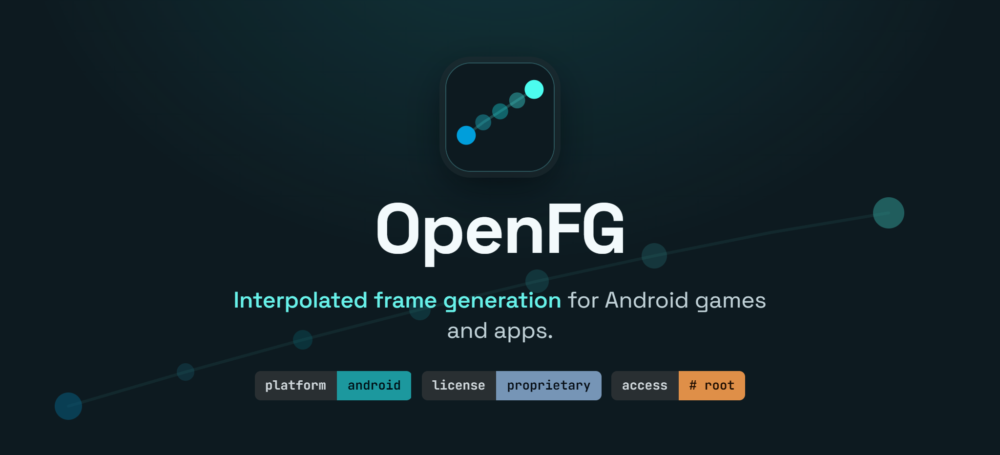

## Compatibility

| Requirement | |
|---|---|
| **Android** | 10 or newer (11+ recommended) |
| **Root** | KernelSU **or** Magisk, with **Zygisk** enabled |
| **CPU / ABI** | arm64 (64-bit) or arm32 (32-bit) |
| **Graphics** | OpenGL ES 3.0+ or Vulkan games |

**Tested on:** Qualcomm Snapdragon / Adreno and Arm Mali. Other GPUs (Xclipse, PowerVR) are expected to
work but aren't verified yet. **Emulators:** supported — BannerHub, GameNative, Winlator, PPSSPP, Eden
and Citra tested.

## Install

1. **Flash the module** — in the KernelSU or Magisk app → **Modules → Install from storage** → select
   `openfg-<version>-release.zip` → **reboot**.
2. **Install the app** — install `openfg-app-<version>.apk`.
3. **Pick your games** — open the **OpenFG** app and toggle on the games you want enhanced.
4. **Play** — Launch a selected game. A small on-screen counter (real / generated FPS) confirms frame
   generation is active.

To disable it for a game, toggle it off in the app and restart that game.

## Download

Grab the latest **module zip** and **APK** from the [Releases](../../releases) page.

## Notes

- **Use at your own risk.** OpenFG changes how games present frames. **Online games with anti-cheat may
  flag modified clients** — don't use it there.
- **Closed source for now.** Binaries only; no source is distributed. Provided as-is, without warranty.

---

*OpenFG — Open Frame Generation.*
